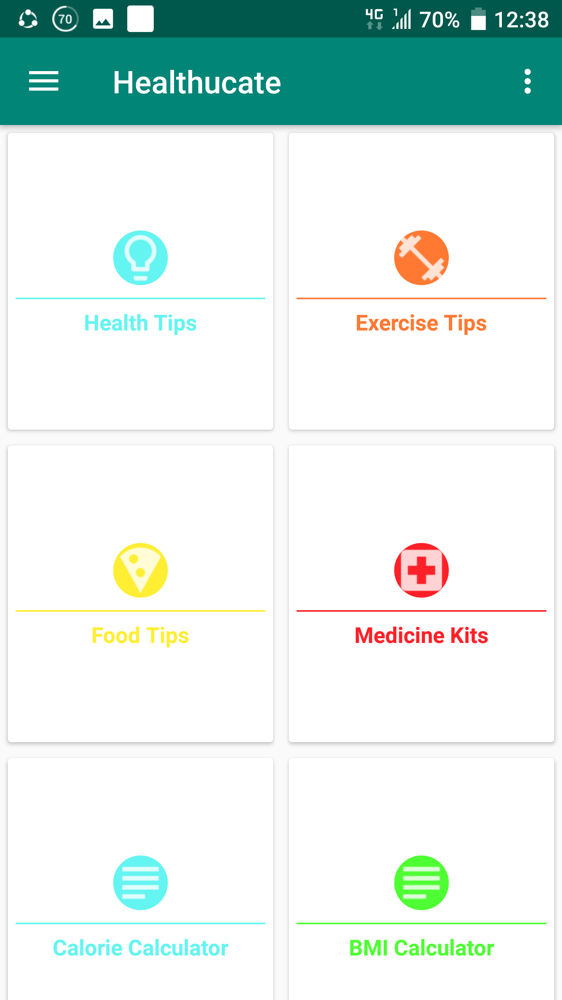
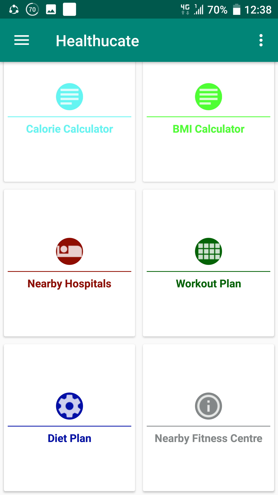

# Project Description

Healthucate is an android app that is based on health and fitness. The project is built in Android Studio platform using Java and Sqlite.

## Features:
1. User Registration System
2. Healthy Foods and Body Exercises Tutorial System.
3. BMI Calculator
4. To-Do List System
5. Nearby Hospital and Gym Searching System 

### Languages: 
Java
### Databases:
SQLite
### Tools and Technologies: 
Android Studio

## Project Demo:

### Splash Screen
   

### Login Registration
  

### User Panel
 

### Food Tips
 

   
   
   
   
     

## Topics:
1.Splash Screen with Threading    
2. CardView   
3. ListView    
5. Adapter      
6. Sqlite Database    
7. UI Components  
8. Navigation Components  

